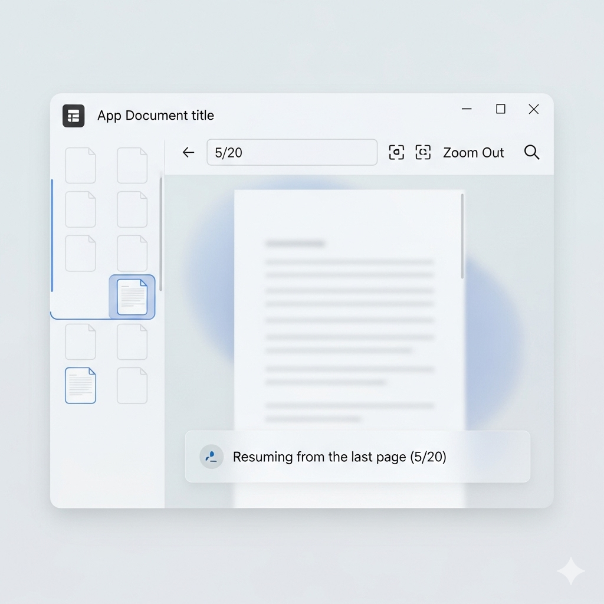

# PDF Reader

Це настільний додаток для перегляду PDF-файлів, створений за допомогою Python, PyQt6 та PyMuPDF.



## ✨ Функції

- **Відкриття та перегляд PDF-файлів**: Легко відкривайте та переглядайте PDF-документи.
- **Навігація по сторінках**:
    - Переходьте на наступну та попередню сторінки.
    - Вводьте номер сторінки для прямого переходу.
- **Гортання сторінок колесом миші**: Швидко переключайтеся між сторінками за допомогою колеса миші (коли інструмент "рука" неактивний).
- **Масштабування**:
    - Збільшуйте та зменшуйте масштаб.
    - Вибирайте передвстановлені рівні масштабування (50%, 75%, 100%, 125%, 150%, 175%, 200%).
    - Вводьте власний відсоток масштабування безпосередньо в поле.
    - Автоматично підганяйте масштаб під ширину або висоту сторінки ("Fit Width", "Fit Page").
    - Додаток запам'ятовує останній вибраний режим масштабування.
- **Закладки**:
    - Додавайте закладки до важливих сторінок.
    - Переглядайте список закладок на бічній панелі.
    - Видаляйте закладки через контекстне меню (правою кнопкою миші).
- **Перетягування сторінки (рука)**:
    - Активуйте інструмент "рука" на панелі інструментів (або клавішею "H").
    - Натисніть ліву кнопку миші та перетягуйте сторінку для плавної навігації.
- **Пошук**: Шукайте текст у всьому документі.
- **Збереження сесії**: Додаток автоматично зберігає останній відкритий файл, сторінку та налаштування масштабування, щоб ви могли продовжити з того місця, де зупинилися.
- **Підтримка великих файлів**: Покращена робота з PDF-файлами високої роздільної здатності, що запобігає помилкам при відображенні великих сторінок.
- **Сучасний інтерфейс**: Простий та інтуїтивно зрозумілий інтерфейс у стилі Windows 11.
- **Запуск у максимальному розмірі**: Додаток автоматично відкривається в максимальному розмірі для зручності.

## 🐞 Виправлення помилок

- **Плавне панорамування**: Усунено ефект "дрижання" при використанні інструменту "рука", що забезпечує значно плавнішу навігацію по сторінці.
- **Виправлено помилку масштабування**: Усунено проблему, через яку при запуску програми з налаштуваннями масштабування "Fit Page" або "Fit Width" сторінка відображалася у зменшеному вигляді. Тепер масштабування коректно застосовується після повного розгортання вікна.

## 🛠️ Використані технології

- **Python**: Основна мова програмування.
- **PyQt6**: Для створення графічного інтерфейсу користувача.
- **PyMuPDF (fitz)**: Для роботи з PDF-документами (читання та рендеринг).

## 🚀 Як запустити

1.  **Клонуйте репозиторій:**
    ```bash
    git clone <repository-url>
    cd PDF_Reader
    ```

2.  **Створіть та активуйте віртуальне середовище:**
    ```bash
    python -m venv venv
    source venv/bin/activate  # Для Windows: venv\Scripts\activate
    ```

3.  **Встановіть залежності:**
    ```bash
    pip install -r requirements.txt
    ```

4.  **Запустіть додаток:**
    ```bash
    python main.py
    ```
